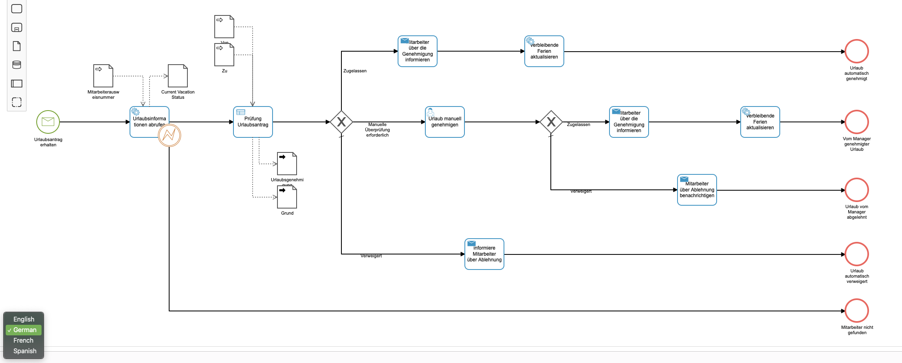

  

# Camunda Modeler - Model Internationalization

*Have a Process Model that implements the i18n extension and has i18n translations already in it?*

Then this is the right plugin for you. This plugin will load the defined language translations for all BPMN items:

Usage:
1. The plugin will determine what (if any) languages have i18n extensions in your model
2. A Green Languages dropdown will appear on the canvas
3. Choose whatever language you want.
4. Your model will be displayed in that language

## Example

Put this directory into the `plugins` directory of the Camunda Modeler and you're ready to go.
First click on the "Generate IDs" button and check if all IDs are fine. Then click on Rename IDs and save your BPMN file.

If you're interested in how to create your own plugins see the [documentation](https://github.com/camunda/camunda-modeler/tree/547-plugins/docs/plugins) and this [example](https://github.com/camunda/camunda-modeler-plugin-example).
