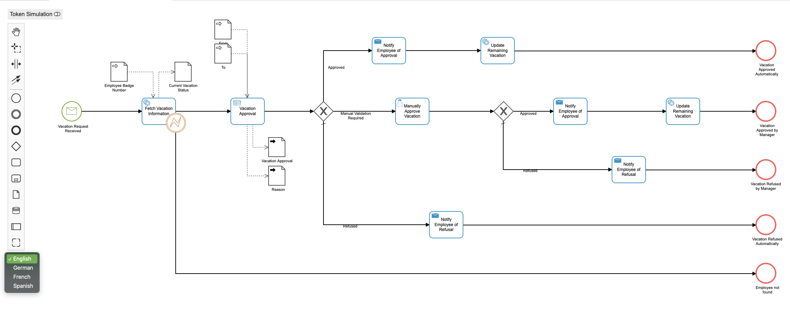
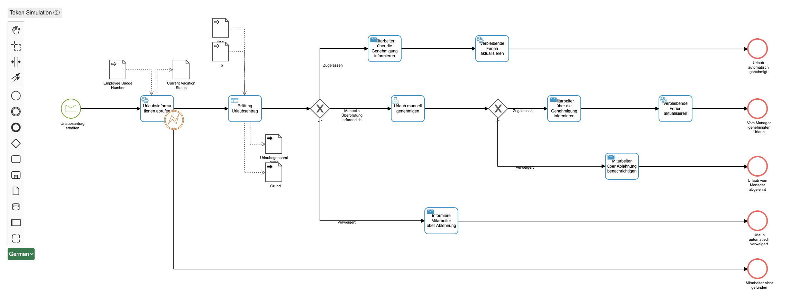

 (https://img.shields.io/badge/Lifecycle-Proof%20of%20Concept-blueviolet)](https://github.com/Camunda-Community-Hub/community/blob/main/extension-lifecycle.md#proof-of-concept-)

# Camunda Modeler - Model Internationalization

*Have a Process Model that implements the `<i18n:Translation>` extension and has `<i18n:Translation>` elements already in it?*

Then this is the right plugin for you. This plugin will load the defined language translations for all BPMN items:

Usage:
1. The plugin will determine what (if any) languages have `<i18n:Translation>` extensions in your model
2. A Green Languages dropdown will appear on the canvas
3. Choose whatever language you want.
4. Your model will be displayed in that language

## Example

Put this directory into the `plugins` directory of the Camunda Modeler and you're ready to go.
If there are translations in your model, you can select the language from the dropdown and your model will be displayed in that language.

**NOTE:** This plugin will not provide translations but will only display translations that _already_ exist in your model.

If you're interested in how to create your own plugins see the [documentation](https://github.com/camunda/camunda-modeler/tree/547-plugins/docs/plugins) and this [example](https://github.com/camunda/camunda-modeler-plugin-example).
